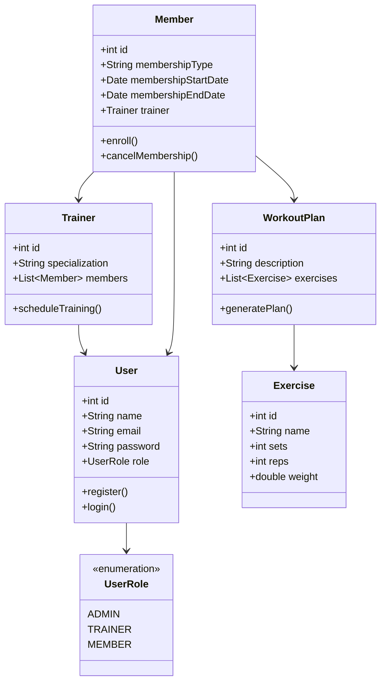

# projeto_dio

#Diagrama de Classes

```mermaid
classDiagram

    class User {
        +int id
        +String name
        +String email
        +String password
        +UserRole role
        +register()
        +login()
    }

    class Trainer {
        +int id
        +String specialization
        +List~Member~ members
        +scheduleTraining()
    }

    class Member {
        +int id
        +String membershipType
        +Date membershipStartDate
        +Date membershipEndDate
        +Trainer trainer
        +enroll()
        +cancelMembership()
    }

    class WorkoutPlan {
        +int id
        +String description
        +List~Exercise~ exercises
        +generatePlan()
    }

    class Exercise {
        +int id
        +String name
        +int sets
        +int reps
        +double weight
    }

    class UserRole {
        <<enumeration>>
        ADMIN
        TRAINER
        MEMBER
    }

    User --> UserRole
    Trainer --> User
    Member --> User
    Member --> Trainer
    Member --> WorkoutPlan
    WorkoutPlan --> Exercise
```
